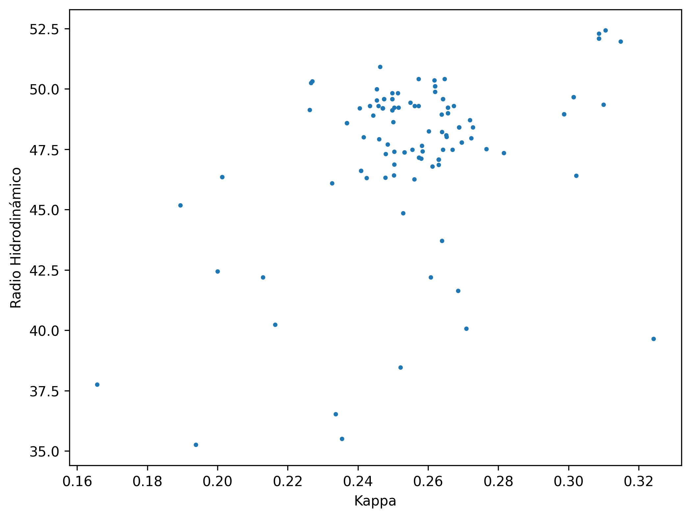
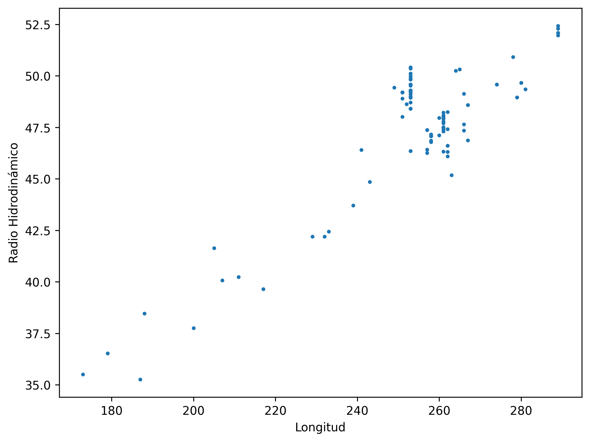

# bioinformatics-e1a-analysis

# E1A Protein Analysis

Bioinformatics project focused on the analysis of E1A protein sequences using multiple sequence alignments (MSA), physicochemical property calculations, disorder prediction, and data visualization.

## Overview

This project analyzes a collection of E1A protein sequences from different organisms using Python and bioinformatics tools. The workflow includes sequence analysis, amino acid composition, hydrodynamic radius estimation, charge distribution analysis, protein disorder prediction, and visualization of the obtained results.

The analysis was originally developed as part of a Bioinformatics course and later adapted into a reproducible GitHub project.

---

## Objectives

- Analyze E1A protein sequence variability.
- Calculate sequence identity between proteins.
- Determine amino acid composition.
- Estimate hydrodynamic radius.
- Evaluate charge distribution using the Kappa parameter.
- Predict intrinsically disordered regions using AIUPred.
- Generate graphical representations of the results.

---

## Methods

### Sequence Analysis

The project uses multiple sequence alignments (MSA) in FASTA format and performs:

- Protein length calculation
- Pairwise sequence identity analysis
- Amino acid frequency analysis
- Net charge calculation

### Physicochemical Properties

For each sequence:

- Hydrodynamic radius estimation
- Charge distribution analysis
- Kappa parameter calculation using LocalCIDER

### Disorder Prediction

Protein disorder prediction is performed using AIUPred, generating disorder scores for each residue and integrating the results back into the aligned sequences.

### Visualization

The workflow generates scatter plots to explore relationships between:

- Kappa vs Hydrodynamic Radius
- Sequence Length vs Hydrodynamic Radius

---

## Key Findings

- E1A proteins show variability in sequence length across species.
- Charge distribution patterns can be quantified using the Kappa parameter.
- Hydrodynamic radius is associated with protein length and composition.
- AIUPred identifies extensive intrinsically disordered regions within E1A proteins.

---

## Example Visualizations

### Kappa vs Hydrodynamic Radius



### Sequence Length vs Hydrodynamic Radius



---

## Project Structure

```text
bioinformatics-e1a-analysis/
│
├── data/
│   ├── E1A_MSA.fasta
│   ├── E1A_MSA1.fasta
│   ├── E1A_MSA2.fasta
│   ├── E1A_MSA_sin_gaps1.fasta
│   ├── E1A_MSA_sin_gaps2.fasta
│   └── AIUPred-1.0.zip
│
├── notebooks/
│   └── e1a_protein_analysis.ipynb
│
├── results/
│   ├── csv/
│   ├── figures/
│   └── *.txt
│
├── requirements.txt
└── README.md
```

### Directory Description

| Directory | Description |
|------------|-------------|
| `data/` | Input FASTA files |
| `notebooks/` | Main Jupyter Notebook containing the complete analysis workflow |
| `results/csv/` | Generated tables and processed results |
| `results/figures/` | Generated visualizations and plots |
| `results/` | AIUPred output files |
| `requirements.txt` | Python dependencies required to run the project |
| `tools/aiupred/` | AIUPred package used for disorder prediction |

## Technologies

- Python
- BioPython
- LocalCIDER
- AIUPred
- Matplotlib
- Jupyter Notebook

---

## Installation

### 1. Clone the repository

```bash
git clone https://github.com/fran9300/bioinformatics-e1a-analysis.git
cd bioinformatics-e1a-analysis
```

### 2. Install dependencies

```bash
pip install -r requirements.txt
```

### 3. Launch Jupyter Notebook

```bash
jupyter notebook
```

Open:

```text
notebooks/e1a_protein_analysis.ipynb
```

and run all cells sequentially.

---

## Required Dependencies

The project requires the following Python packages:

```text
biopython
localcider
matplotlib
torch
```

All dependencies can be installed automatically using:

```bash
pip install -r requirements.txt
```

---

## Results

The workflow generates:

### Sequence Analysis

- Protein length calculations
- Pairwise sequence identity calculations
- Amino acid composition statistics
- Average amino acid frequencies

### Physicochemical Properties

- Net charge calculations
- Hydrodynamic radius estimation
- Kappa parameter analysis

### Disorder Prediction

- Intrinsic disorder prediction using AIUPred
- Disorder score integration into aligned sequences
- Gap-aware disorder alignments

### Visualizations

- Kappa vs Hydrodynamic Radius
- Sequence Length vs Hydrodynamic Radius

Generated outputs are stored in the `results/` directory.

---

## AIUPred

This project uses AIUPred v1.0 (Publication release) for protein disorder prediction.

```text
tools/aiupred/AIUPred-1.0/
```
Official repository:

https://github.com/doszilab/AIUPred

---

## Reproducibility

All analyses can be reproduced directly from the provided notebook using the files included in the repository.

The workflow includes:

1. Loading multiple sequence alignments (MSA)
2. Sequence identity analysis
3. Amino acid composition analysis
4. Hydrodynamic radius calculation
5. Kappa parameter calculation
6. AIUPred disorder prediction
7. Result generation and visualization

---

## Author

**Francisco Kin**

Bioinformatics and Data Analytics student interested in:

- Bioinformatics
- Data Analysis
- Machine Learning
- Biological Sequence Analysis
- Healthcare and Life Sciences Applications

